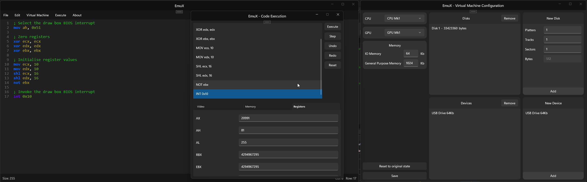

# EmuX



## What is EmuX

EmuX is an open source software meant to simplify the process of learning x86 assembly by allowing the user to write and debug their application written in x86 assembly inside and IDE while having all of that code being execute on top of an intermediate layer to easily modify the state of the container and step through instructions step by step.

Also EmuX being open source means that it won't share the same fate as Emu8086, a software many people are aware of around this sphere that has sadly gone out of support. EmuX has, on purpose, been designed to allow easy modifications and addition of new instructions by other developers, for more about how to contribute click [here](Contributing.md).

## What can someone do in EmuX ?

Due to the intermediate language approach and the containerised nature of EmuX the user has power over even the smallest details of the code execution, some of these features are the following.

Someone can modify the container in the following ways
1) Change the memory available to the VM
2) Change the CPU the VM has installed
3) Change the GPU the VM has installed
4) Add or remove disks to the VM with varying amout of platters / tracks / sectors
5) Add or remove external device to the VM with the own logic

Someone can also do the following action when debugging their code
1) Step through the code one instruction at a time
2) Undo the actions of previous instruction
3) Read and / or modify the memory values
4) Read and / or modify the register values
5) View the screen buffer in real time
6) Reset code execution / the state of the container

## How does EmuX work

EmuX works by having all of the code execution being inside of a containarised environment. The code exists in an intermediate format which on one hand some may say it is sub optimal due to the implications it has to performance but this also allows for new instructions to easily be added due to its nature. This also gives more freedom to monitor the state of the code and the container whilst also having the ability to easily modify the state or the specifications of the container.

> [!WARNING]
> As of now instructions do not get translated into their machine code equivalent and then stored in memory, EmuX follows a Harvard architecture approach, as such self modifying code cannot exist in EmuX.

Other pros of this approach is its easy expansion of the supported instructions, for more details regarding adding new instructions visit [here](Contributing/Adding%20new%20instructions.md), but if you also wish you can add new [registers](Contributing/Adding%20new%20registers.md), [virtual devices](Contributing/Adding%20new%20virtual%20devices.md), or even [BIOS interrupts](Contributing/Adding%20new%20BIOS%20interrupts.md) amongst other things.

```
+--------------------+
|        Code        |
+--------------------+
           |
           | Source code gets converted to an intermediate language format
           |
           v
+--------------------+
| Intermediate layer |  <- EmuX containarised environment
+--------------------+
           |
           v
+--------------------+
|      Hardware      |
+--------------------+
```

## Project structure

The project is split into three main parts for easy maintenance and separation of concerns.

**EmuXCore** - The core logic of EmuX where all instructions, devices, decoders, lexer etc are located<br>
**EmuXCoreUnitTests** - The unit tests to verify the logic of EmuXCore<br>
**EmuXUI** - The UI for the user to interact  with EmuXCore developed in WinUI3<br>

If you want you can only take the latest version of EmuXCore to use it for your project.

---

Version: 2.0.1
